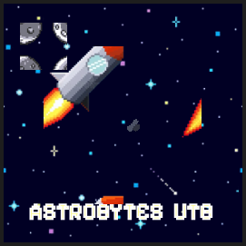

# AWorldAway - NASA Space Apps Challenge 2025 🚀

<div align="center">
    
    
[](https://www.spaceappschallenge.org/)
[](LICENSE)
[](https://moonrepo.dev)
</div>

> **AI/ML application for NASA Space Apps Challenge 2025**: _"A World Away: Hunting for Exoplanets with AI"_

An interactive web application that leverages NASA's open exoplanet datasets to analyze space mission data and automatically identify exoplanet candidates using machine learning. Built with cutting-edge technologies and designed for astronomical discovery.

---

## ✨ Features

-   🤖 **ML-Powered Predictions**: Binary classification model (Random Forest) trained on KOI, K2, and TESS mission data
-   🌍 **Interactive 3D Visualization**: Immersive planet explorer built with Three.js
-   📊 **Real-time Analytics**: Comprehensive model metrics and performance dashboards
-   🌐 **Multilingual Support**: Full i18n support (English & Spanish)
-   🎨 **Modern UI**: Built with Nuxt 4, Vue 3, and Tailwind CSS
-   ⚡ **Fast API**: Python FastAPI backend with optimized predictions
-   📈 **Data Pipeline**: Automated harmonization of multiple NASA datasets

---

## 🛠️ Technologies Used

### Frontend

-   **Nuxt 4** - Meta-framework for Vue 3
-   **Vue 3** - Progressive JavaScript framework
-   **Tailwind CSS** - Utility-first CSS framework
-   **Three.js** - 3D graphics library
-   **shadcn-vue** - Beautiful UI components
-   **TypeScript** - Type-safe development

### Backend

-   **FastAPI** - Modern Python web framework
-   **scikit-learn** - Machine learning library
-   **pandas** - Data manipulation and analysis
-   **joblib** - Model serialization
-   **Pydantic** - Data validation

### DevOps & Tools

-   **Moonrepo** - Monorepo orchestrator
-   **pnpm** - Fast, disk space efficient package manager
-   **uv** - Ultra-fast Python package installer
-   **Docker** - Containerization
-   **ESLint** - Code linting
-   **Ruff** - Python linter/formatter

---

## 📁 Project Structure

```text
AWorldAway_Nasa2025/
├── apps/
│   ├── web/              # Nuxt 4 frontend application
│   │   ├── app/          # Application code
│   │   ├── i18n/         # Internationalization
│   │   └── components/   # Vue components
│   └── server/           # FastAPI backend
│       ├── src/          # Source code
│       ├── models/       # Trained ML models
│       └── assets/       # Static assets
├── packages/
│   └── analytics/        # Data processing & ML pipeline
│       ├── data/         # Raw and processed datasets
│       ├── scripts/      # Python scripts for data harmonization
│       └── .output/      # Generated models and reports
├── scripts/              # Build and deployment scripts
├── .moon/                # Moonrepo configuration
└── moon.yml              # Root task orchestration
```

---

## 🚀 Quick Start

### Prerequisites

-   **Node.js** >= 20.x
-   **Python** >= 3.13
-   **pnpm** >= 9.x ([Install](https://pnpm.io/installation))
-   **uv** >= 0.4.x ([Install](https://docs.astral.sh/uv/getting-started/installation/))
-   **moonrepo** ([Install](https://moonrepo.dev/docs/install))

#### Installing Prerequisites

**1. Install pnpm:**

```bash
# Via npm
npm install -g pnpm

# Or via Corepack (recommended)
corepack enable
corepack prepare pnpm@latest --activate
```

**2. Install uv (Python package manager):**

```bash
# macOS/Linux
curl -LsSf https://astral.sh/uv/install.sh | sh

# Windows (PowerShell)
powershell -c "irm https://astral.sh/uv/install.ps1 | iex"

# Or via pip
pip install uv
```

**3. Install moonrepo:**

```bash
npm install -g @moonrepo/cli
```

### Installation

1. **Clone the repository**

    ```bash
    git clone https://github.com/lunajimenez/AWorldAway_Nasa2025.git
    cd AWorldAway_Nasa2025
    ```

2. **Install dependencies**

    ```bash
    pnpm install
    ```

3. **Run the application** 🎉

    ```bash
    moon source:dev
    ```

    This single command will:

    - ✅ Generate the ML model from harmonized datasets (`analytics:generate`)
    - ✅ Copy the model to the server (`source:copy-model`)
    - ✅ Start the FastAPI backend on `http://localhost:8000`
    - ✅ Start the Nuxt frontend on `http://localhost:3000`

4. **Open your browser**
    ```
    http://localhost:3000
    ```

---

## 🎯 Available Commands

### Development

```bash
# Run full development environment (recommended)
moon source:dev

# Run only the web frontend
moon web:dev

# Run only the API server
moon server:run

# Regenerate ML model from datasets
moon analytics:generate

# Copy generated model to server
moon source:copy-model
```

### Production Build

```bash
# Prepare production build (generate model + copy)
moon source:prepare

# Deploy (requires configuration)
moon source:deploy
```

### Individual Tasks

```bash
# Install web dependencies
moon web:pnpm -- install

# Add shadcn-vue components
moon web:shadcn -- add button

# Run Python scripts with uv
moon analytics:uv -- run scripts/harmonize_intersection.py
```

---

## 📊 Model Performance

Our binary classification model achieves:

-   **ROC AUC**: 88.89%
-   **PR AUC**: 77.74%
-   **Accuracy**: 81.24%
-   **Macro F1**: 78.68%
-   **Optimal Threshold**: 0.3433

The model uses 9 features including:

-   Orbital period (days)
-   Transit duration (hours)
-   Planet radius (Earth radii)
-   Equilibrium temperature (K)
-   Transit depth (ppm)
-   Insolation flux (Earth flux)
-   Stellar radius (Solar radii)
-   Stellar temperature (K)
-   Source mission (Kepler/K2/TESS)

---

## 🌐 API Endpoints

### Model Predictions

-   `GET /api/model/predict-one` - Single exoplanet candidate prediction
-   `POST /api/model/predict-params` - Batch predictions
-   `GET /api/model/metrics` - Model performance metrics
-   `GET /api/model/info` - Model configuration

### Documentation

-   Interactive API docs: `http://localhost:8000/docs`
-   OpenAPI schema: `http://localhost:8000/openapi.json`

---

## 🎨 Key Features

### 1. Interactive 3D Planet Explorer

Explore a procedurally generated planet with orbiting moons using Three.js. Features include:

-   Real-time camera controls (WASD + mouse)
-   Dynamic lighting and shadows
-   Procedural textures for planets and moons
-   Starfield background with 1000+ stars

### 2. ML Prediction Interface

User-friendly form to input exoplanet parameters and get instant predictions with:

-   Real-time validation
-   Confidence scores
-   Visual result modal with interpretation
-   Multilingual support

### 3. Metrics Dashboard

Comprehensive visualization of model performance:

-   Confusion matrix
-   Classification report
-   ROC/PR AUC scores
-   Dataset statistics
-   Feature importance

---

## 🔧 Configuration

### Environment Variables

Create a `.env` file in the `apps/server/` directory:

```env
# Server Configuration
HOST=0.0.0.0
PORT=8000

# CORS Origins (comma-separated)
CORS_ORIGINS=http://localhost:3000,http://127.0.0.1:3000
```

For the frontend (`apps/web/.env`):

```env
API_BASE_URL=http://localhost:8000
```

---

## 🐳 Docker Deployment

Build and run with Docker Compose:

```bash
moon source:deploy
```

---

## 📝 Data Pipeline

Our data processing pipeline:

1. **Data Collection**: KOI, K2, and TESS datasets from NASA
2. **Harmonization**: Align features across different missions using `uv` scripts
3. **Feature Engineering**: Calculate derived physics-based features
4. **Model Training**: Random Forest classifier with hyperparameter tuning
5. **Evaluation**: Comprehensive metrics and visualization
6. **Deployment**: Model serialization (joblib) and API integration

The entire pipeline is orchestrated by **moonrepo** and runs with a single command.

---

## 👥 Team

**AstroBytes UTB** - Universidad Tecnológica de Bolívar

-   **Luna Jiménez** - Team Leader & Data Scientist
-   **Cristian Acosta** - Frontend Developer
-   **Anyelo Cardenas** - Data Engineer
-   **Maikol Guzman** - ML Engineer
-   **Mauro Gonzalez** - Fullstack Developer & Data Scientist

---

## 📄 License

This project is licensed under the MIT License - see the [LICENSE](LICENSE) file for details.

---

## 🙏 Acknowledgments

-   NASA for providing open exoplanet datasets
-   Space Apps Challenge organizers
-   The open-source community
-   [Astral](https://astral.sh/) for the amazing `uv` tool
-   [Moonrepo](https://moonrepo.dev/) for monorepo orchestration

---

## 🔗 Links

-   [NASA Exoplanet Archive](https://exoplanetarchive.ipac.caltech.edu/)
-   [Space Apps Challenge](https://www.spaceappschallenge.org/)
-   [Project Repository](https://github.com/yourusername/AWorldAway_Nasa2025)
-   [uv Documentation](https://docs.astral.sh/uv/)
-   [Moonrepo Documentation](https://moonrepo.dev/docs)

---

<div align="center">
    Made with ❤️ by AstroBytes UTB for NASA Space Apps Challenge 2025
</div>
