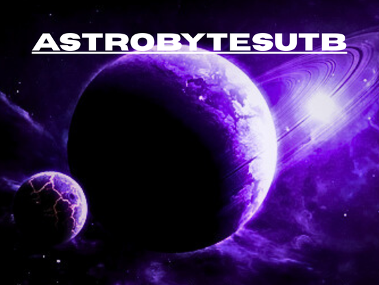

# AWorldAway_Nasa2025

<p align="center">
    
</p>

AI/ML app for NASA Space Apps Challenge 2025: “A World Away: Hunting for Exoplanets with AI”. We build an application using NASA’s open exoplanet datasets to analyze space mission data and automatically identify new exoplanets.

---

## Technologies Used

- **Moonrepo**: Monorepo manager to organize frontend, backend, and data analysis.
- (Coming soon) Frameworks for frontend and backend.
- (Coming soon) Data analysis and machine learning tools.

---

## Project Structure

```text
AWorldAway_Nasa2025/
├─ apps/           # Main applications (frontend, backend, etc.)
├─ packages/       # Shared libraries and utilities (including data analysis)
├─ assets/         # Images and general resources
├─ .moon/          # Moonrepo configuration
├─ README.md
└─ ...
```

---
